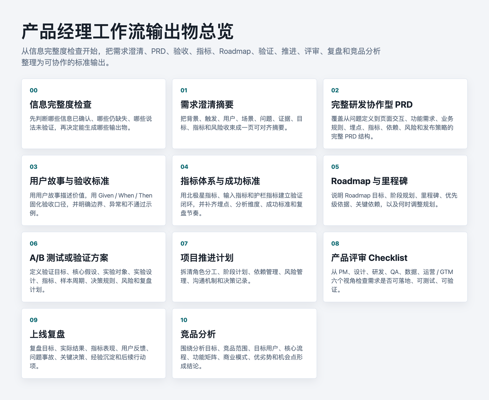

# 产品经理工作流 Skill

一个面向产品经理的全流程 Codex Skill：从模糊想法出发，通过访谈式澄清，逐步生成可评审、可研发、可验证的产品交付物。

## 核心特点

- 先访谈澄清，再生成文档
- 一次只问一个问题，节奏清楚
- 不替用户脑补，缺失信息必须标记为“待确认”
- 用户需求必须追问证据来源，没有证据则标记为“未验证”
- 正式输出前先做信息完整度检查
- 支持 PRD、用户故事、验收标准、指标体系、Roadmap、A/B 验证、项目推进、评审 Checklist、上线复盘和竞品分析

## 文件结构

```text
.
├── README.md
├── product-manager-workflow-single.md
├── skill/
│   ├── SKILL.md
│   ├── agents/openai.yaml
│   └── references/templates.md
└── images/
    ├── overview.png
    ├── 00-information-completeness-check.png
    ├── 01-requirement-clarification-summary.png
    ├── 02-prd.png
    ├── 03-user-stories-acceptance-criteria.png
    ├── 04-metrics-success-criteria.png
    ├── 05-roadmap-milestones.png
    ├── 06-ab-test-validation-plan.png
    ├── 07-project-delivery-plan.png
    ├── 08-product-review-checklist.png
    ├── 09-launch-retrospective.png
    └── 10-competitor-analysis.png
```

## 输出物总览



## 使用方式

如果平台支持上传完整 Skill 文件夹，上传 `skill/` 目录。

如果平台只支持单个 Markdown 文件，上传 `product-manager-workflow-single.md`。

## 默认工作流

1. 背景与触发原因
2. 目标与业务结果
3. 用户与使用场景
4. 当前问题与证据
5. 成功指标
6. 方案边界与非目标
7. 约束、依赖与风险
8. 优先级与里程碑
9. 上线验证与复盘方式

## 默认输出物

1. 需求澄清摘要
2. 完整研发协作型 PRD
3. 用户故事与验收标准
4. 指标体系与成功标准
5. Roadmap 与里程碑
6. A/B 测试或验证方案
7. 项目推进计划
8. 产品评审 Checklist
9. 上线复盘
10. 竞品分析

